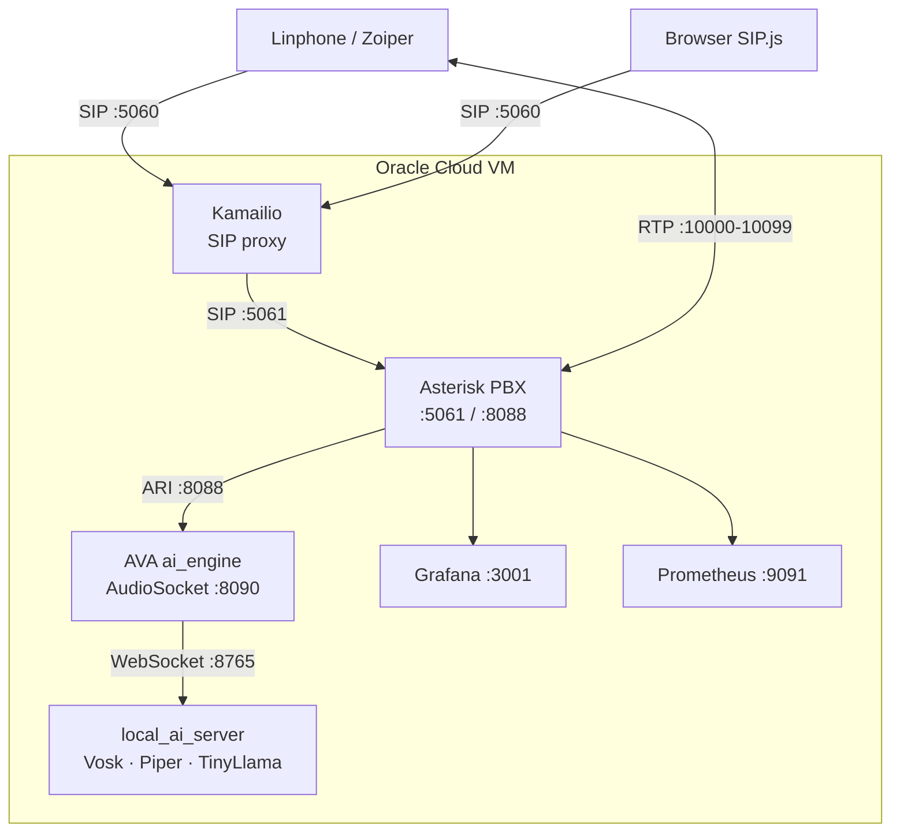

# asterisk-voip-lab

## Architecture

Containerised VoIP lab stack built with Kamailio, Asterisk, and AVA AI engine.
Foundation for an AI-powered voice support product for Shopify merchants.

## Stack

- Kamailio — SIP proxy, public-facing
- Asterisk — PBX, handles calls and routing
- AVA ai_engine — Python AI brain, connects to Asterisk via ARI
- local_ai_server — fully local STT + LLM + TTS (Vosk + TinyLlama + Piper)
- SIP.js widget — browser softphone, no install needed
- Grafana + Prometheus — monitoring and observability

## Call Flow

    SIP client / browser
          |
    Kamailio :5060 (SIP proxy)
          |
    Asterisk :5061 (PBX)
          |
    AVA ai_engine :8090 (AudioSocket)
          |
    local_ai_server :8765 (STT + LLM + TTS)

## Services

    Service          Port        Description
    kamailio         5060        SIP proxy, public facing
    asterisk         5061 8088   PBX and ARI
    ai_engine        8090        AVA AI brain
    local_ai_server  8765 15000  Local AI models and metrics
    widget           3000        Browser softphone
    grafana          3001        Dashboards
    prometheus       9091        Metrics scraper

## Quick Start

    cp .env.example .env
    docker compose up -d --build

## Extensions

    101       pass101      Your phone (Linphone)
    102       pass102      PC softphone
    browser   passbrowser  Browser widget
    200       —            AI agent (AVA) — in progress
    300       —            Echo test

## Debug

    docker exec -it kamailio sngrep
    docker exec -it asterisk asterisk -rvvvv
    docker logs -f ai_engine
    docker logs -f local_ai_server

## References

- AVA: https://github.com/hkjarral/Asterisk-AI-Voice-Agent
- Asterisk image: https://hub.docker.com/r/andrius/asterisk
- Kamailio: https://www.kamailio.org
- SIP.js: https://sipjs.com
